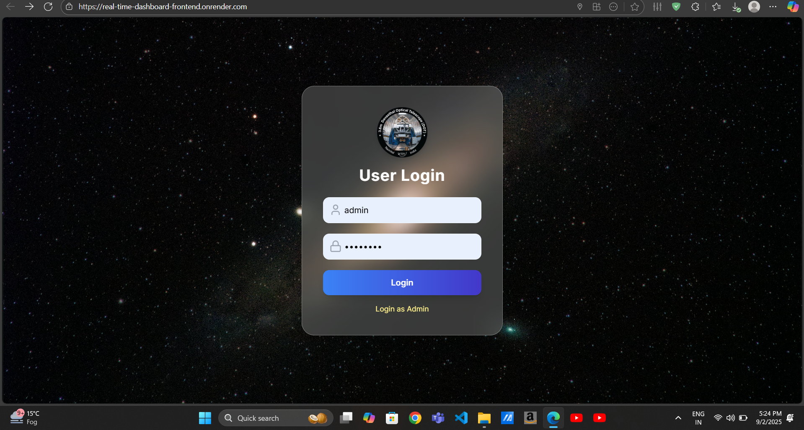
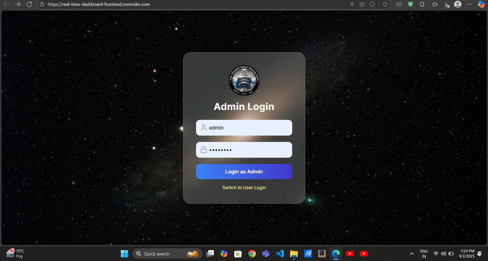
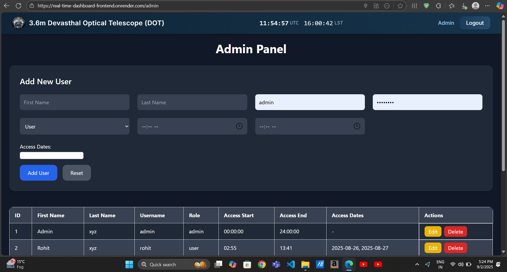
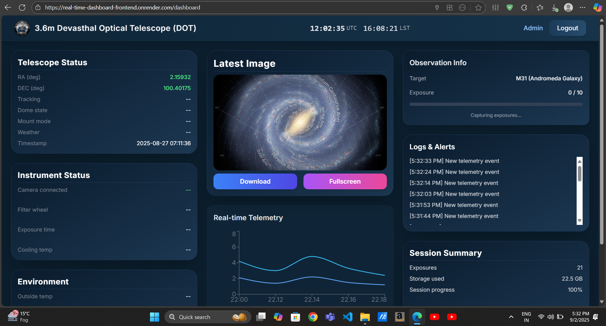

# 🔭 Real-Time-Dashboard Project For 3.6m Devasthal Optical Telescope [Largest Optical Telescope In Asia] 

A full-stack project developed during my internship at **ARIES**.  
This project provides a secure **login system** with role-based access, an **admin panel** for user management, and a **real-time telescope data dashboard**.
---

## 🚀 Live Demo
Check it out here: [Real-Time Dashboard on Render](https://real-time-dashboard-frontend.onrender.com)

---

## ✨ Features
### 🔐 Authentication
- **Admin Login**
  - Admin can log in anytime
  - Access to Admin Panel for user management
- **User Login**
  - Checks user **role**, **date**, and **access time** from `.csv` files
  - Grants access only if conditions are met

### 🛠️ Admin Panel
- Manage users via `.csv` files
- Update roles, dates, and access times
- Easy and editable by admin at any time

### 📊 User Dashboard
- Opens after successful user login
- Displays **real-time telescope data** (updates every 1 second)
- Data is fetched from a `.log` file and shown on the dashboard

---

## 📂 Project Structure
telescope-project/
├── backend/ # Login, Admin Panel, CSV management, Log file reader
├── dashboard/ # User Dashboard (real-time telescope data display)
├── README.md # Project Documentation
├── LICENSE # MIT License
└── .gitignore # Ignore unnecessary files

---

## 🛠️ Tech Stack
- **Frontend:** React.js, Tailwind CSS  
- **Backend:** Node.js + Express.js  
- **Database / Storage:** `.csv` files for user data, `.log` file for telescope data  
- **Other:** Git, GitHub  

---
# Real-Time Dashboard

This is a real-time dashboard project.

## Screenshots

### User Login Page

### Admin Login Page

### Admin Panel For Admin Tasks

### Dashboard UI

🚀 Getting Started

Follow these steps to set up the project locally:

1️⃣ Clone the Repository
git clone https://github.com/Vikas2080/Real-Time-Dashboard.git
cd Real-Time-Dashboard

2️⃣ Run Backend
cd backend
npm install
npm start

Backend will start at http://localhost:5000

3️⃣ Run Dashboard (Frontend)

Open a new terminal:

cd dashboard
npm install
npm start

Frontend will start at http://localhost:3000
